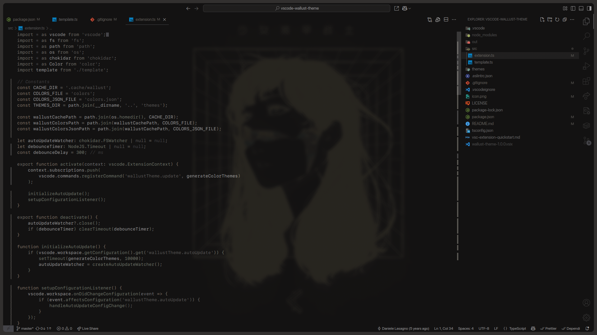
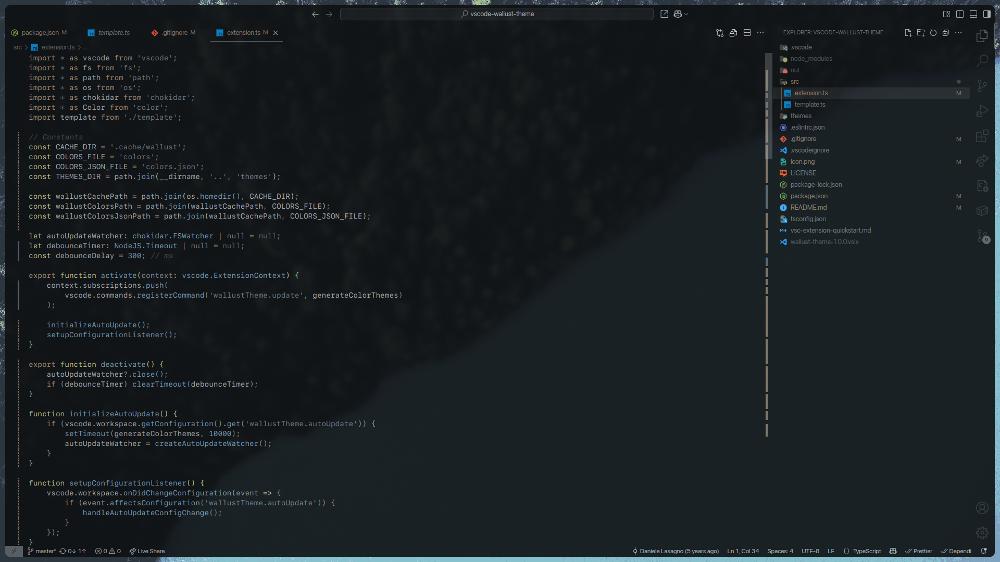
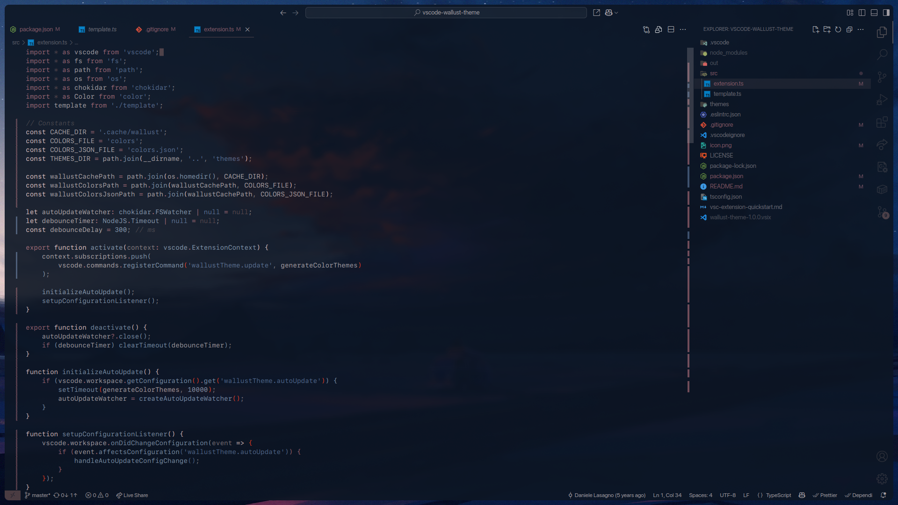

# Wallust Theme

Wallust Theme syncs your VS Code colors in real time with your current wallpaper palette, powered by [wallust](https://codeberg.org/explosion-mental/wallust).

## Screenshots
>
> **Note:** The blurred background of vscode in the screenshots reflect my personal compositor settings.

| VS Code | Wallpaper |
|---------|-----------|
|  |  |
|  |  |
|  |  |

## Features

- **Real-time color updates:** Instantly adapts the VS Code theme to your current wallpaper palette.
- **Two theme variants:** Choose between a clean borderless look or a bordered style for editor panes.
- **Minimal configuration:** Simple setup with provided templates and easy toggling of auto-update.

## Requirements

1. **Install [wallust](https://codeberg.org/explosion-mental/wallust):**
    This extension relies on wallust for generating color palettes. Ensure wallust is installed and properly configured.

2. **Templates:**
    Two wallust templates are required, available in the [assets/templates](./assets/templates) directory of this repository. These templates must be referenced in your wallust configuration.

3. **Configure `wallust.toml`:**
    Add the following entries to your `wallust.toml` file to generate the necessary color files:

    ```toml
    vscode = { src = 'vscode.json', dst = '~/.cache/wallust/colors.json' }
    vscode2 = { src = 'vscode', dst = '~/.cache/wallust/colors' }
    ```

4. **Usage:**
    Make sure wallust is running and generating the color files using the above templates before updating the theme in VS Code.

## Extension Commands

- **`wallustTheme.update`**: Manually trigger an update of the theme based on the latest wallpaper palette.

## Extension Settings

- **`wallustTheme.autoUpdate`**: Enable or disable automatic theme updates whenever your wallpaper changes.

## Troubleshooting

If the extension doesn't update automatically, while the auto updates are enabled, try to do a manual update with the update command.
If the manual update doesn't work try reloading the window.

---

## Credits

- **Special thanks** to [ComputerKeeda](https://github.com/ComputerKeeda) for their invaluable help in troubleshooting and improving this extension.
- Inspired by the excellent work on [Wal Theme](https://github.com/dlasagno/vscode-wal-theme).
